# Complete Enhanced SEO Platform Architecture

```mermaid
graph TB
    subgraph "Client Layer"
        WEB[React Web App]
        PWA[Progressive Web App]
        MOBILE[React Native Apps]
        EXTENSION[Browser Extension]
        CLI[CLI Tool]
    end

    subgraph "API Gateway Layer"
        KONG[Kong API Gateway]
        GRAPHQL[GraphQL Server]
        WEBSOCKET[WebSocket Server]
    end

    subgraph "Core Services"
        AUTH[Auth Service]
        CORE_API[Core API Service]
        SEARCH[Search Service]
        ANALYTICS[Analytics Service]
    end

    subgraph "AI Services"
        VISION[GPT-4 Vision Service]
        CONTENT[Content Generation Service]
        VOICE[Voice Search Service]
        CHAT[LLM Chat Service]
    end

    subgraph "Real-time Services"
        MONITOR[Real-time Monitor]
        ALERTS[Alert Service]
        STREAM[Stream Processor]
        EVENTS[Event Bus]
    end

    subgraph "ML Services"
        PREDICT[Prediction Service]
        TRAIN[Training Pipeline]
        MODELS[Model Registry]
        AUTOML[AutoML Service]
    end

    subgraph "Automation Services"
        WORKFLOW[Workflow Engine]
        SCHEDULER[Task Scheduler]
        BULK[Bulk Operations]
        INTEGRATION[Integration Hub]
    end

    subgraph "Data Layer"
        POSTGRES[(PostgreSQL)]
        REDIS[(Redis)]
        ELASTIC[(Elasticsearch)]
        CLICKHOUSE[(ClickHouse)]
        TIMESCALE[(TimescaleDB)]
        PINECONE[(Pinecone Vector DB)]
        S3[(S3/MinIO)]
    end

    subgraph "External APIs"
        DATAFORSEO[DataForSEO API]
        GOOGLE[Google APIs]
        OPENAI[OpenAI API]
        ANTHROPIC[Anthropic API]
    end

    subgraph "Infrastructure"
        K8S[Kubernetes]
        KAFKA[Apache Kafka]
        CELERY[Celery Workers]
        PROMETHEUS[Prometheus]
        GRAFANA[Grafana]
    end

    %% Client connections
    WEB --> KONG
    PWA --> KONG
    MOBILE --> KONG
    EXTENSION --> GRAPHQL
    CLI --> CORE_API

    %% API Gateway routing
    KONG --> CORE_API
    KONG --> AUTH
    KONG --> ANALYTICS
    GRAPHQL --> CORE_API
    WEBSOCKET --> MONITOR

    %% Service interactions
    CORE_API --> POSTGRES
    CORE_API --> REDIS
    CORE_API --> SEARCH
    SEARCH --> ELASTIC

    %% AI service connections
    VISION --> OPENAI
    CONTENT --> ANTHROPIC
    CONTENT --> OPENAI
    CHAT --> PINECONE

    %% Real-time flow
    MONITOR --> STREAM
    STREAM --> KAFKA
    KAFKA --> EVENTS
    EVENTS --> ALERTS
    MONITOR --> CLICKHOUSE

    %% ML pipeline
    PREDICT --> MODELS
    TRAIN --> MODELS
    AUTOML --> TRAIN
    PREDICT --> TIMESCALE

    %% Automation flow
    WORKFLOW --> CELERY
    SCHEDULER --> CELERY
    BULK --> KAFKA
    INTEGRATION --> GOOGLE

    %% Data connections
    ANALYTICS --> CLICKHOUSE
    PREDICT --> POSTGRES
    MODELS --> S3

    %% External API usage
    CORE_API --> DATAFORSEO
    ANALYTICS --> GOOGLE

    %% Monitoring
    K8S --> PROMETHEUS
    PROMETHEUS --> GRAFANA
```



## Service Descriptions

### 🎯 Client Layer
- **React Web App**: Main dashboard with 3D visualizations
- **PWA**: Offline-capable progressive web app
- **React Native**: iOS/Android apps with native features
- **Browser Extension**: Quick SEO analysis tool
- **CLI Tool**: Developer-friendly command line interface

### 🔌 API Gateway Layer
- **Kong**: Rate limiting, auth, caching
- **GraphQL**: Flexible queries with subscriptions
- **WebSocket**: Real-time bidirectional communication

### 🏗️ Core Services
- **Auth Service**: JWT, OAuth, SSO, 2FA
- **Core API**: Main business logic (FastAPI)
- **Search Service**: Full-text search capabilities
- **Analytics Service**: Metrics aggregation and reporting

### 🤖 AI Services
- **GPT-4 Vision**: Visual SERP and competitor analysis
- **Content Generation**: Multi-language SEO content
- **Voice Search**: Voice query optimization
- **LLM Chat**: Conversational SEO assistant

### ⚡ Real-time Services
- **Real-time Monitor**: Minute-by-minute tracking
- **Alert Service**: Multi-channel notifications
- **Stream Processor**: High-volume data processing
- **Event Bus**: Service communication

### 🧠 ML Services
- **Prediction Service**: Ranking & traffic forecasts
- **Training Pipeline**: Automated model training
- **Model Registry**: Version control for ML models
- **AutoML**: Automated model optimization

### 🔄 Automation Services
- **Workflow Engine**: Visual workflow execution
- **Task Scheduler**: Cron-based scheduling
- **Bulk Operations**: Large-scale processing
- **Integration Hub**: 50+ third-party connectors

### 💾 Data Layer
- **PostgreSQL**: Primary relational data
- **Redis**: Caching and sessions
- **Elasticsearch**: Full-text search
- **ClickHouse**: Real-time analytics
- **TimescaleDB**: Time-series data
- **Pinecone**: Vector embeddings
- **S3/MinIO**: Object storage

### 🌐 External APIs
- **DataForSEO**: SEO data provider
- **Google APIs**: GA4, Search Console, Ads
- **OpenAI**: GPT-4, embeddings
- **Anthropic**: Claude for content

### 🏭 Infrastructure
- **Kubernetes**: Container orchestration
- **Kafka**: Event streaming
- **Celery**: Distributed task queue
- **Prometheus**: Metrics collection
- **Grafana**: Visualization dashboards

## Data Flow Examples

### 1. Real-time Rank Tracking
```
User Request → WebSocket → Monitor Service → DataForSEO API
                     ↓
                ClickHouse ← Stream Processor ← Kafka
                     ↓
              Alert Service → Push Notification
```

### 2. AI Content Generation
```
User Input → Core API → Content Service → Claude/GPT-4
                ↓                              ↓
           Keyword Data ← DataForSEO     Generated Content
                ↓                              ↓
           SEO Scoring → Optimization → Final Content
```

### 3. Predictive Analytics
```
Historical Data → Training Pipeline → Model Registry
                         ↓                    ↓
                   AutoML Service      Prediction Service
                         ↓                    ↓
                  Optimized Models → User Predictions
```

## Scalability Metrics

- **API Response Time**: < 200ms (p95)
- **Real-time Latency**: < 1 second
- **Concurrent Users**: 100,000+
- **Keywords Tracked**: 10M+
- **Daily API Calls**: 1B+
- **Data Retention**: 2 years
- **Uptime SLA**: 99.9%

## Security Features

- 🔐 End-to-end encryption
- 🛡️ WAF protection
- 🔑 API key rotation
- 📝 Audit logging
- 🚪 Zero-trust architecture
- 🌍 GDPR compliant
- 🔒 Data isolation per tenant